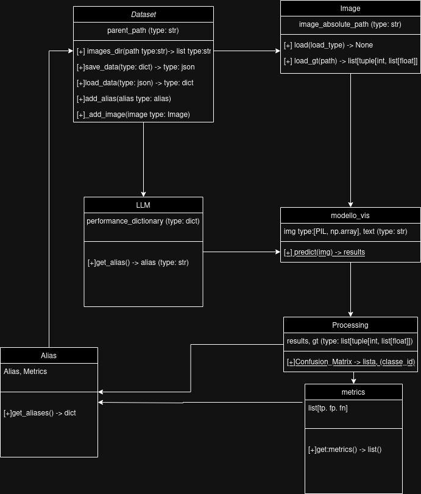

<p align="center">
  <h1>AUTOL LABELING</h1>

  <a href="https://img.shields.io/badge/LLM-phi3%20mini%204k%20onnx-lightblue?style=for-the-badge&logo=phi3">
    
  </a>

<a href="https://img.shields.io/badge/Spellcheck-Pass-green?style=flat">
  
</a>

<a href="https://img.shields.io/badge/OS%20platform%20supported-Windows-green?style=flat">
  
</a>

<a href="https://img.shields.io/badge/OS%20platform%20supported-Unix-green?style=flat">
  
</a>

<a href="https://img.shields.io/badge/Language-Python-yellowgreen?style=flat">
  
</a>

<a href="https://img.shields.io/badge/PEP8%20CheckOnline-Passing-green">
  
</a>

<a href="https://img.shields.io/badge/Test-Pass-green">
  
</a>

</p>

## Description

UML of the project:



Reference links:

[Grounding-DINO]()

[PHI-3 model CPU](https://github.com/microsoft/onnxruntime-genai/blob/main/examples/python/phi-3-tutorial.md#run-on-cpu)

[PHI-3 model ONNX](https://huggingface.co/microsoft/Phi-3-mini-4k-instruct-onnx/tree/main/cpu_and_mobile)

## Requirements

To install the requiments:

Make shure to have started your python virtual environment!
In order to keep your python interpreter clean on your machine.

On Linux:

```bash
$/auto_labeling> souce .venv/bin/activate
```

On windows:

```bash
$/auto_labeling> .venv/Scripts/activate
```

Then procede with the installation of the libraries used in the packet

```bash
$/auto_labeling> pip install -r requirements.txt
```

## Execution

```bash
$/auto_labeling/bin> python pipeline.py
```

## Authors

- GioMont3
- Daniele-Cannella
- Gulia-peretti
- Alessandro
- AbitanteDiScampia
- Neetre
