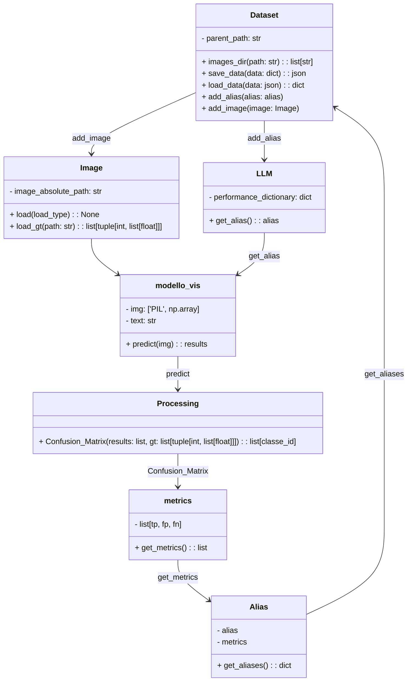

<div align="center">
  <h1>AUTO LABELING</h1>

  

  

  

  <br>

  

  

  

  

  

  
</div>

## Table of Contents

- [Description](#pencil2-description)
- [Requirements](#clipboard-requirements)
- [Execution](#diamond_shape_with_a_dot_inside-execution)
- [References](#link-references)
- [Authors](#busts_in_silhouette-authors)

## :pencil2: Description

UML of the project:



## :clipboard: Requirements

Make shure to have 'huggingface-cli' installed on your machine, or download it from [here](https://huggingface.co/docs/huggingface_hub/guides/cli).

To install the libraries used in the programs:

Make shure to have started your python virtual environment!
In order to keep your python interpreter clean on your machine.

On Linux:

```bash
$/auto_labeling> source .venv/bin/activate
```

On windows:

```bash
$/auto_labeling> .venv/Scripts/activate
```

Then procede with the installation of the libraries used in the packet

```bash
$/auto_labeling> pip install -r requirements.txt
```

## :diamond_shape_with_a_dot_inside: Execution

```bash
$/auto_labeling/bin> python pipeline.py
```

## :link: References

- [Grounding-DINO](https://huggingface.co/IDEA-Research/grounding-dino-base)
- [PHI-3 model CPU](https://github.com/microsoft/onnxruntime-genai/blob/main/examples/python/phi-3-tutorial.md#run-on-cpu)
- [PHI-3 model ONNX](https://huggingface.co/microsoft/Phi-3-mini-4k-instruct-onnx/tree/main/cpu_and_mobile)

## :busts_in_silhouette: Authors

- GioMont3
- Daniele-Cannella
- Gulia-peretti
- Alessandro
- AbitanteDiScampia
- Neetre
